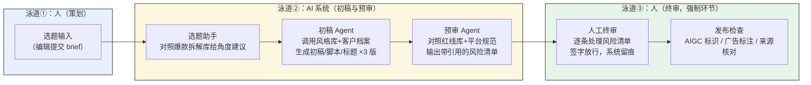

# 核心系统方案：内容知识库与 AI 创作流水线

**本章结论**：五大知识库为 AI 提供“知识约束”，创作流水线为其提供“工作流”；二者以“人工终审不可妥协”为核心原则，AI 负责初稿与预审，人负责策划与终审。

### 5.1 五大知识库设计

| 知识库 | 内容 | 来源 | 更新频率 | 责任角色 |
|---|---|---|---|---|
| 风格指南库 | 文风定位、句式规范、禁用词、结构模板 | 主编室定版 | 季度 | 主编 |
| 平台规范库 | 各平台标题/封面/时长/导流/标识规则 | 运营部汇编 | **周更** | 平台运营 |
| 爆款拆解库 | 高表现内容的选题模型、结构复盘 | 每周复盘会 | 周更 | 策划组 |
| 客户档案库 | 品牌关键词、人群、红线、历史最佳内容 | 商务部（脱敏） | 随签约 | 商务 |
| 合规红线库 | 广告法、AIGC 标识、绝对禁区清单 | 法务顾问审定 | 月度 | 指定合规员 |

知识治理三原则：**原始文档不可变**（作为溯源锚点）、**每条知识有编号可引用**（如 XL-LAW-05 §1）、**每库有唯一更新责任人**。

> **反方论证**：对五大知识库最强的反对理由是——**小团队维护五个知识库、且要周更/月更，持续成本可能高于收益，最终沦为"建完即烂尾"**。这一质疑成立，本方案以三处设计回应：其一，**差异化更新频率**（平台规范库周更、风格库季度、合规库月度）按各库变动速度分配成本，而非一刀切全部高频维护；其二，**不必一次建全五库**——第 3 章诊断总分低于 12 分的企业首期只做合规红线库与平台规范库这两个"保命"库（对应第 4 章 P0），风格/爆款/客户档案库随成熟度递进补齐；其三，**每库唯一更新责任人 + 第 12 章周更责任制 + 年度运营审计**，把"会不会烂尾"从依赖自觉转为制度约束。若贵司连两个 P0 库的月度维护都无人认领，则说明尚不具备上线条件——这正是诊断环节要提前甄别的。

### 5.2 AI 创作流水线（阶段 2 核心交付）

（图：创作流水线三泳道——AI 只占中间一段，选题决策与终审放行始终在人的泳道内。）

关键设计：预审 Agent 的输出不是“通过/不通过”，而是**带引用的风险清单**（“第 3 段'销量第一'触发 XL-LAW-05 §2 极限词禁令”），把 AI 从“裁判”降格为“提示器”，终审权始终在人。

> **反方论证**：对创作流水线最强的反对理由是——**多一道预审 Agent 加一道人工终审，流程反而更长；若 AI 初稿质量不稳定，"改 AI 初稿"比"自己写"更费劲，形成"负向提效"，编辑会觉得是负担而绕开系统**。这一质疑切中要害，本方案以四处设计回应：其一，**预审 Agent 输出带引用的风险清单而非裁判结论**，编辑核对清单比自查全文更快，是"减负"而非"加审"；其二，**初稿 Agent 一次生成 3 版供选择**，降低"改不如写"的概率；其三，**M3 灰度上线**（第 9 章）——先在部分选题验证初稿可用率达标，再全流程推开，不达标即回退调优，避免强推负向工具；其四，采纳率被列为 ROI 核心敏感变量（第 10 章三情景分析），即本方案已把"编辑绕开系统"识别为最大风险并据此设计拉动机制，而非假设员工必然配合。界面财联社在保留三审的前提下仍实现净提效（见下），佐证"多一道审 ≠ 更慢"在方法得当时成立。

> **案例参考**：上海报业集团旗下界面财联社的财经内容智能生产平台“酷编”，在保留“三审”人工审核机制的前提下，实现内容产出量提升 3 倍、发布速度提升 5 倍，上市公司财报审核准确率达 100%（该数据经财经媒体转载确认，核实说明见案例文件）。即便是对准确性要求极高的财经媒体，头部机构在效率提升的同时依然保留多轮人工审核，印证了“人工终审不可妥协”并非保守，而是可持续做法。详见 附录 C 案例库（C-02 界面财联社）。

### 5.3 P0/P1 场景解决方案卡片

第 4 章优先级矩阵中的 2 个 P0、3 个 P1 场景，是本方案建议贵司在阶段 1–2 实际落地的全部内容。本节为每个场景各给一张卡片，说明它解决什么问题、具体怎么做、做出来长什么样、验收看哪个指标、最容易在哪里做砸。

**阅读说明**：①卡片中的知识条目编号遵循 第 5.1 节知识治理三原则的“每条知识有编号可引用”规则，编号格式为“库前缀-类别-序号”（XL=合规红线库、PT=平台规范库、FG=风格指南库、KH=客户档案库、BK=爆款拆解库）；②“真实使用示例”为**模拟示意对话**，用于呈现交付形态——对话中的库版本号、条目编号、答复话术为示例格式，实际条目与话术在阶段 1 建库时按法规原文与贵司资料核定，示例中涉及的法规条款（如《广告法》相关禁则）以法规原文为准；③每张卡片的“达到什么效果”均对应第 10.1 节指标体系；依据类型符号 ②③ 的定义见该节统一脚注（③ 的完整免责表述见第 1 章预期成效段，后文仅以符号标注）。

---

#### 卡片一（P0）：合规红线 + 平台规范问答

**【解决什么问题】** 多数公司的合规知识散落在群聊记录和老员工记忆里，而《标识办法》已施行、一次专项执法即处置违规账号 13421 个（数据与来源见第 7 章），靠口口相传守不住这条线。附录 A 对运营的访谈题“平台规则变动如何获知与同步、过去半年被限流/下架几次”正是用来暴露这一痛点。

**【怎么做】**
1. 指定合规员牵头，法务顾问审定，建合规红线库（月度更新，见 第 5.1 节）；
2. 平台运营汇编四大平台标识与内容规则，建平台规范库（周更，规则要点可直接取自第 7 章平台规则对比表）；
3. 两库接入知识库问答机器人，嵌入公司现有的企微/飞书（第 2.3 节“逻辑缝合”原则，不新增工具）；
4. 全员只读、写权限仅责任人（第 6 章权限设计）；
5. 与第 7 章发布前合规检查清单联动，作为预审 Agent（卡片五）的规则来源。

**【做成什么样子】**（模拟示意）

> **编辑**：这条美妆视频文案能说“7天美白”吗？
> **系统**：触发红线 XL-LAW-05 §2 医疗功效禁用词——化妆品内容不得宣称医疗作用或使用医疗用语（依据《广告法》第十七条，条目由法务顾问审定），建议改为“妆感提亮”等使用感受类表述，是否采用请交人工终审确认。[引用: 合规红线库 v2.3 · XL-LAW-05 §2]
> **编辑**：这条视频 AI 生成的部分比较多，抖音要怎么标？
> **系统**：AI 生成内容占比达到或超过 50% 时，须在片头前 3 秒、封面、简介三处标注（规则出处见第 7 章平台规则对比表，以平台创作者服务中心最新公告为准）。[引用: 平台规范库 v5.7 · PT-DY-03]

**【达到什么效果】** 对应第 10.1 节合规指标“违规下架与限流事件数趋零”③，以及质量指标“抽检回答准确率 ≥85%”②（附录 B 的 50 题双盲评验收方法适用于本场景）。

**【常见跑偏】** 最容易做砸的方式：从网上抓一份“违禁词大全”直接灌库。这类二手清单往往过时、过严且无出处，结果是系统误拦正常表述，编辑被烦到绕开系统，库随之荒废。规避方法：每条红线必须经法务顾问审定、附法规原文出处，月度更新走 第 5.1 节唯一责任人机制——宁可首月只有 50 条经过审定的红线，不要 5000 条来路不明的违禁词。

---

#### 卡片二（P0）：新人培训与写稿自查

**【解决什么问题】** 文风与结构规范往往只“写在老编辑脑子里”，新人培养全靠口传心授，返工集中在同几类低级错误上反复发生。附录 A 对主编的三个访谈题（新人多久独立出稿、返工三大原因、文风写在哪里）正是为暴露这一痛点设计。

**【怎么做】**
1. 主编室定版风格指南库（文风定位、句式规范、禁用词、结构模板，季度更新，见 第 5.1 节）；
2. 策划组把每周复盘会的高表现内容拆解沉淀进爆款拆解库（周更）；
3. 新人入职即开通知识库问答权限，写稿疑问先问库、再问人；
4. 出稿前对照库内自查清单逐项核对，再提交主编终审；
5. 新人高频提问但库内“未收录”的问题，每月由主编补录成新条目——培训库随新人的真实疑问生长。

**【做成什么样子】**（模拟示意）

> **新入职编辑**：公司标题的风格要求是什么？能用“震惊体”吗？
> **系统**：标题规范为“事实前置、悬念后置”，禁用震惊体与标题党句式（见 §3 禁用句式清单）。附本账号历史高表现标题 3 例供参照（示例从略，实际由爆款拆解库调取）。[引用: 风格指南库 v1.4 · FG-TIT-02；爆款拆解库 v8.2 · BK-TIT-11]
> **新入职编辑**：结尾要不要加引导关注的话术？
> **系统**：未收录该问题的定版规范，请咨询主编并建议补录。（触发“不编造”原则，见第 7 章第 5 条）

**【达到什么效果】** 对应第 10.1 节推导逻辑中“新编辑独立出稿周期 −30~50%”③，并贡献于“稿件返工轮次 −50%”③；“库外问题明确说未收录”对应附录 B“无中生有率 100%”验收线②。

**【常见跑偏】** 最容易做砸的方式：把历年所有旧文档一股脑导入当“培训库”。未经治理的文档堆里新旧规范并存、互相矛盾，新人检索到三个版本的“标题规范”反而无所适从。规避方法：遵循 第 5.1 节“原始文档不可变 + 定版才入库”——只有主编室定版的现行规范才进入检索范围，历史版本归档留底不参与问答。

---

#### 卡片三（P1）：客户品牌档案统一调用

**【解决什么问题】** 品牌关键词用错、踩客户合同红线、调性与人群错位，是代运营/商单业务最贵的一类返工——轻则整篇重写，重则丢掉客户（附录 A 对商务的访谈题“客户资料存在哪、拿错口径的事故发生过吗”即指向此）。第 2.4 节显示行业收入结构正转向“做内容 + 精细化运营”，客户口径管理的重要性只增不减。

**【怎么做】**
1. 商务部按客户整理档案：品牌关键词、目标人群、合同约定红线、历史最佳内容（入库前脱敏，见 第 5.1 节）；
2. 档案随签约/续约即时更新，责任人为对接商务；
3. 按商务线做 RBAC 权限隔离（第 6 章）——A 组编辑看不到 B 组客户档案；
4. 编辑接商单稿时第一步先查档案，初稿 Agent 生成时自动调用同一档案（与卡片四联动）；
5. 客户红线条目同步进预审 Agent 检查范围（与卡片五联动）。

**【做成什么样子】**（模拟示意）

> **编辑**：给 X 品牌写测评，能提竞品对比吗？
> **系统**：不能。该客户合同约定内容中不得出现竞品名称与价格对比（§红线-2）。补充口径：目标人群为 25–35 岁都市女性；品牌关键词须使用“轻养肤”而非“功效护肤”；历史最佳内容 2 条见附链。[引用: 客户档案库 v3.1 · KH-023]

**【达到什么效果】** 对应第 10.1 节效率指标“稿件返工轮次 −50%”③（拿错口径类返工在动笔前消除），检索答复的可核验性对应附录 B“引用溯源率 ≥95%”验收线②。

**【常见跑偏】** 最容易做砸的方式：图省事把客户合同、报价单原件全文入库且全员可见。这等于把商业机密放进了全公司的检索框，一旦泄露损失远超提效收益。规避方法：脱敏后入库（编辑只需要口径与红线，不需要合同金额）、按商务线隔离、写权限仅责任人——第 6 章权限设计正是为此场景准备的。

---

#### 卡片四（P1）：AI 初稿/脚本/标题生成（守风格）

**【解决什么问题】** 产能竞争加剧而利润普遍承压（第 2.1、2.4 节，近八成机构利润率下滑或持平，来源见第 2 章），编辑从零撰写的模式产能上不去、成本下不来。直接裸用通用 AI 写作工具又是第 1 章指出的最常见失败路径——不懂公司风格与客户红线，返工吞掉全部收益。

**【怎么做】**
1. 初稿 Agent 按 第 5.2 节流水线接入风格指南库 + 客户档案库（守风格、守口径是本场景与“裸用工具”的本质区别）；
2. 编辑输入选题 brief（主题、平台、客户、篇幅）；
3. 一次生成 3 版初稿 + 标题×3，降低“改不如写”概率（第 5.2 节反方论证的设计回应）；
4. 编辑择优审改、人工终审定稿，系统留痕；
5. 按第 9 章 M3 灰度机制先在部分选题验证初稿可用率，达标再全流程推开。

**【做成什么样子】**（模拟示意）

> **编辑输入**：Y 客户小红书笔记，主题“秋季新品外套通勤穿搭”，约 600 字，本周五发。
> **系统输出**：已生成 3 版初稿（A 场景叙事型 / B 清单干货型 / C 问答互动型）+ 标题各 3 条。生成约束：文风按 FG-TON-01 口语化亲和风；已规避客户禁用词（该客户不使用“最”“第一”类表述，KH-041 §红线-1）；发布时须勾选“笔记含 AI 合成内容”声明（PT-XHS-02，规则见第 7 章对比表）。[引用: 风格指南库 v1.4；客户档案库 v3.1；平台规范库 v5.7]
> **编辑**：选 B 版，修改后提交终审。

**【达到什么效果】** 对应第 10.1 节效率指标“单篇生产工时 −40%”③——这是全部效率目标的推导基点（见 10.1 推导逻辑），并经由工时释放支撑北极星指标“人均月内容产量 +40%（终审合格口径）”③。

**【常见跑偏】** 最容易做砸的方式：知识库还没建就先上生成工具，或初稿质量未经灰度验证就全员强推。前者回到“裸用工具”的失败路径，后者一旦“改 AI 初稿比自己写还费劲”，编辑将永久性绕开系统（第 5.2 节反方论证识别的“负向提效”）。规避方法：严格按“先知识库、后流水线”顺序上线（第 1 章核心判断二），M3 灰度不达标即回退调优，不硬推。

---

#### 卡片五（P1）：AI 预审（对照红线库）

**【解决什么问题】** 合规与规范问题往往在终审甚至发布后才暴露，此时代价已是返工工时或账号处罚（专项执法力度见第 7 章；附录 A “返工三大原因”“被限流/下架几次”两问即指向此）。逐条核对红线是终审中最机械的部分，最适合交给 AI，把人的精力留给判断题。

**【怎么做】**
1. 预审 Agent 接入合规红线库 + 平台规范库 +（商单稿）客户档案库红线条目；
2. 稿件提交终审前自动全文扫描；
3. 输出**带引用的风险清单**而非“通过/不通过”结论（第 5.2 节关键设计：AI 是提示器，不是裁判）；
4. 编辑对照清单逐条处理或说明；
5. 人工终审签字放行，系统全程留痕（对应第 7 章审核留痕要求）。

**【做成什么样子】**（模拟示意）

> **流水线**：编辑提交带货短视频脚本至预审。
> **预审 Agent 输出风险清单（3 条）**：
> ① 第 2 段“销量第一”触发 XL-LAW-05 §1 极限词禁令（依据《广告法》第九条，条目由法务顾问审定），建议改为可举证的具体销售数据或删除；
> ② 本片 AI 生成素材占比约 60%，达到平台强制标注阈值，须在片头前 3 秒、封面、简介三处标注（PT-DY-03，规则见第 7 章对比表）；
> ③ 本条为商务合作内容，尚未添加“广告”标注，触发 XL-AD-01 广告标注强制项。
> [引用: 合规红线库 v2.3；平台规范库 v5.7]
> **终审人**：逐条处理后签字放行，系统记录处理轨迹。

**【达到什么效果】** 对应第 10.1 节质量指标“预审拦截有效率 ≥80%”②与合规指标“违规下架与限流事件数趋零”③；问题前移同时贡献“稿件返工轮次 −50%”③（见 10.1 推导逻辑）。

**【常见跑偏】** 最容易做砸的方式：把预审 Agent 当裁判——“预审通过”即直接发布，人工终审沦为走过场。一旦出事，责任落点悬空（第 7 章责任边界明确：终审环节是责任落点，不可省略）。规避方法：系统层面不提供“预审通过即发布”通道，预审输出只作为终审人的核对清单，强制人工签字留痕后方可进入发布环节——这既是流程设计，也是第 7 章责任划分成立的技术前提。

